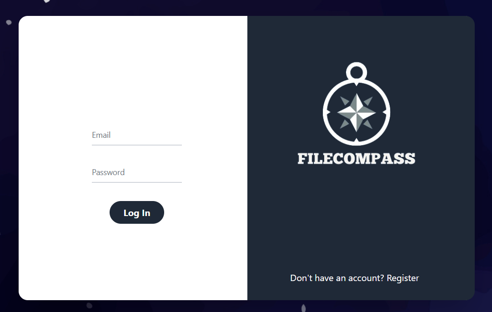
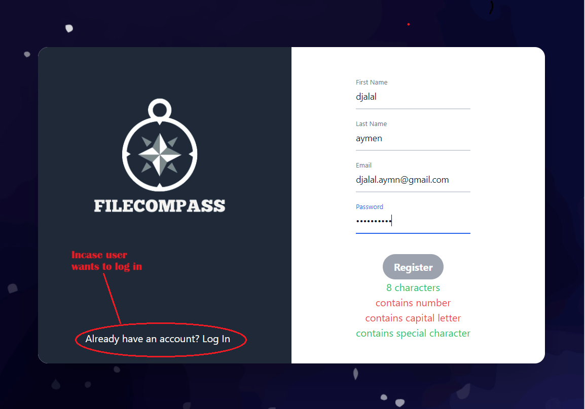

# Electronic Document Management System (EDMS)

## Table of Contents

- [Project Description](#project-description)
- [Features](#features)
- [Installation](#installation)
- [Usage](#usage)
- [Screenshots](#screenshots)
- [Contact Information](#contact-information)
- [Learn More](#learn-more)

## Project Description

This project showcases an Electronic Document Management System developed using modern front-end technologies.
It aims to demonstrate proficiency in building interactive user interfaces and managing application state with React.
Mainly coded in javascript (React.JS,Node.JS)
IT was a project For the [the CERIST](https://www.cerist.dz/index.php/fr/) (Le Centre de Recherche sur l'Information Scientifique et Technique )
## Features

- **User Authentication:** Secure login and authentication mechanisms.
- **Document Upload:** Capability to upload and store documents securely.
- **Search and Filter:** Efficient search and filtering options for easy document retrieval.
- **Role-based Access:** Different access levels (admin, user) with appropriate permissions.
- **Permission and Tracking:** Each file have his own permissions and can add other permission in while sharring it

## Installation

To run this project locally, follow these steps:

1. Clone the repository:

   ```sh
   git clone https://github.com/yourusername/edms.git
   cd edms
2. Install dependency :
   ```sh
   cd back-edn
   npm install
   cd..
   cd front-end
   npm install
## Usage   
1. First Start back-end:
   ```sh
   cd back-end
   npm install
2. Next Start front-end:
   ```sh
   cd ..
   cd front-end
   npm start
3. Open url: **backend will work on exemple:http//:localhost:3000**
   but the front end will always work
   **frontend will work http//:localhost:3001**
## Screenshots
1.Login page And register pages:

.
